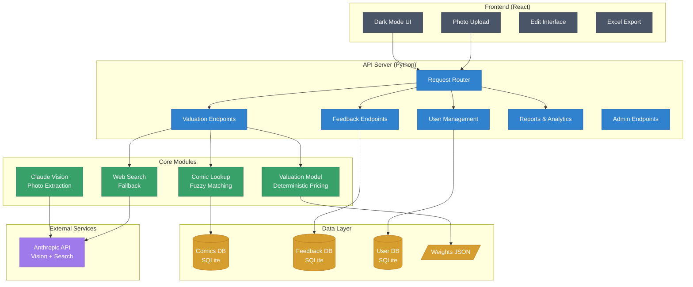
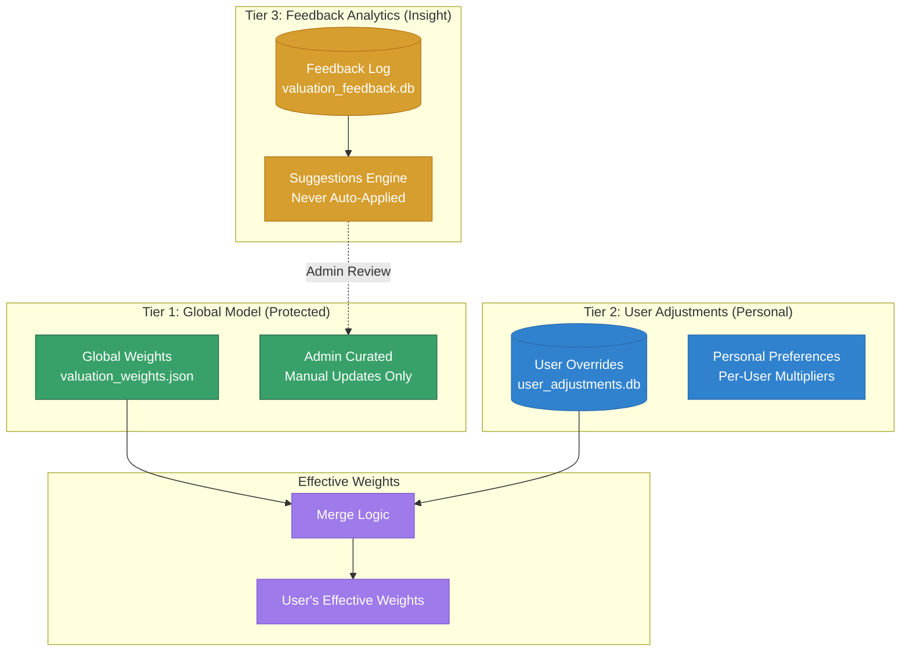
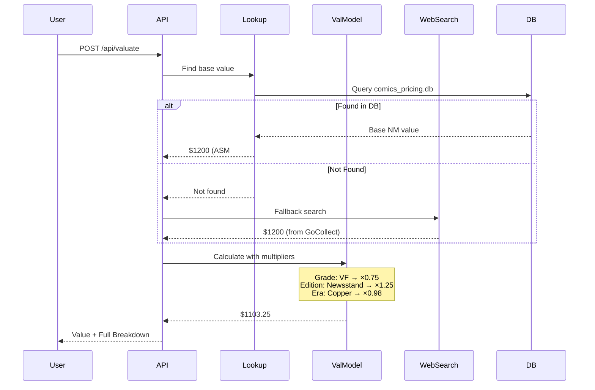
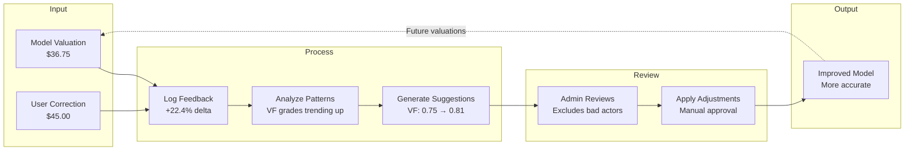

# CollectionCalc Architecture

## System Architecture

```mermaid
flowchart TB
    subgraph Frontend["Frontend (React)"]
        UI[Dark Mode UI]
        Upload[Photo Upload]
        Edit[Edit Interface]
        Export[Excel Export]
    end

    subgraph API["API Server (Python)"]
        Router[Request Router]
        ValuationAPI[Valuation Endpoints]
        UserAPI[User Management]
        FeedbackAPI[Feedback Endpoints]
        ReportsAPI[Reports & Analytics]
        AdminAPI[Admin Endpoints]
    end

    subgraph Core["Core Modules"]
        Vision[Claude Vision<br/>Photo Extraction]
        ValModel[Valuation Model<br/>Deterministic Pricing]
        Lookup[Comic Lookup<br/>Fuzzy Matching]
        WebSearch[Web Search<br/>Fallback]
    end

    subgraph Data["Data Layer"]
        ComicsDB[(Comics DB<br/>SQLite)]
        FeedbackDB[(Feedback DB<br/>SQLite)]
        UserDB[(User DB<br/>SQLite)]
        WeightsFile[/Weights JSON/]
    end

    subgraph External["External Services"]
        Anthropic[Anthropic API<br/>Vision + Search]
    end

    %% Frontend to API
    UI --> Router
    Upload --> Router
    
    %% API to Core
    Router --> ValuationAPI
    Router --> UserAPI
    Router --> FeedbackAPI
    Router --> ReportsAPI
    
    ValuationAPI --> ValModel
    ValuationAPI --> Lookup
    ValuationAPI --> WebSearch
    
    %% Core to Data
    Lookup --> ComicsDB
    ValModel --> WeightsFile
    FeedbackAPI --> FeedbackDB
    UserAPI --> UserDB
    
    %% External
    Vision --> Anthropic
    WebSearch --> Anthropic
    
    %% Styling
    classDef frontend fill:#4a5568,stroke:#2d3748,color:#fff
    classDef api fill:#3182ce,stroke:#2b6cb0,color:#fff
    classDef core fill:#38a169,stroke:#276749,color:#fff
    classDef data fill:#d69e2e,stroke:#b7791f,color:#fff
    classDef external fill:#9f7aea,stroke:#805ad5,color:#fff
    
    class UI,Upload,Edit,Export frontend
    class Router,ValuationAPI,UserAPI,FeedbackAPI,ReportsAPI,AdminAPI api
    class Vision,ValModel,Lookup,WebSearch core
    class ComicsDB,FeedbackDB,UserDB,WeightsFile data
    class Anthropic external
```

## Three-Tier Model Architecture

```mermaid
flowchart TB
    subgraph Tier1["Tier 1: Global Model (Protected)"]
        GlobalWeights[Global Weights<br/>valuation_weights.json]
        AdminCurated[Admin Curated<br/>Manual Updates Only]
    end

    subgraph Tier2["Tier 2: User Adjustments (Personal)"]
        UserOverrides[(User Overrides<br/>user_adjustments.db)]
        PersonalPrefs[Personal Preferences<br/>Per-User Multipliers]
    end

    subgraph Tier3["Tier 3: Feedback Analytics (Insight)"]
        FeedbackLog[(Feedback Log<br/>valuation_feedback.db)]
        Suggestions[Suggestions Engine<br/>Never Auto-Applied]
    end

    subgraph Output["Effective Weights"]
        Merge[Merge Logic]
        EffectiveWeights[User's Effective Weights]
    end

    GlobalWeights --> Merge
    UserOverrides --> Merge
    Merge --> EffectiveWeights
    
    FeedbackLog --> Suggestions
    Suggestions -.->|Admin Review| AdminCurated
    
    classDef tier1 fill:#38a169,stroke:#276749,color:#fff
    classDef tier2 fill:#3182ce,stroke:#2b6cb0,color:#fff
    classDef tier3 fill:#d69e2e,stroke:#b7791f,color:#fff
    classDef output fill:#9f7aea,stroke:#805ad5,color:#fff
    
    class GlobalWeights,AdminCurated tier1
    class UserOverrides,PersonalPrefs tier2
    class FeedbackLog,Suggestions tier3
    class Merge,EffectiveWeights output
```

## Valuation Flow

```mermaid
sequenceDiagram
    participant User
    participant API
    participant Lookup
    participant ValModel
    participant WebSearch
    participant DB

    User->>API: POST /api/valuate
    API->>Lookup: Find base value
    Lookup->>DB: Query comics_pricing.db
    
    alt Found in DB
        DB-->>Lookup: Base NM value
        Lookup-->>API: $1200 (ASM #300)
    else Not Found
        Lookup-->>API: Not found
        API->>WebSearch: Fallback search
        WebSearch-->>API: $1200 (from GoCollect)
    end
    
    API->>ValModel: Calculate with multipliers
    Note over ValModel: Grade: VF → ×0.75<br/>Edition: Newsstand → ×1.25<br/>Era: Copper → ×0.98
    ValModel-->>API: $1103.25
    
    API-->>User: Value + Full Breakdown
```

## Feedback Loop

```mermaid
flowchart LR
    subgraph Input
        Valuation[Model Valuation<br/>$36.75]
        UserCorrection[User Correction<br/>$45.00]
    end

    subgraph Process
        Log[Log Feedback<br/>+22.4% delta]
        Analyze[Analyze Patterns<br/>VF grades trending up]
        Suggest[Generate Suggestions<br/>VF: 0.75 → 0.81]
    end

    subgraph Review
        AdminReview[Admin Reviews<br/>Excludes bad actors]
        Apply[Apply Adjustments<br/>Manual approval]
    end

    subgraph Output
        BetterModel[Improved Model<br/>More accurate]
    end

    Valuation --> Log
    UserCorrection --> Log
    Log --> Analyze
    Analyze --> Suggest
    Suggest --> AdminReview
    AdminReview --> Apply
    Apply --> BetterModel
    BetterModel -.->|Future valuations| Valuation
```

## Data Flow

```mermaid
flowchart LR
    Photo[📷 Photo] --> Vision[Claude Vision]
    Vision --> Extract[Extract:<br/>Title, Issue, Grade]
    Extract --> Lookup[DB Lookup]
    
    Lookup --> |Found| Model[Valuation Model]
    Lookup --> |Not Found| WebSearch[Web Search]
    WebSearch --> Model
    
    Model --> Breakdown[Calculation Breakdown]
    Breakdown --> Display[Display to User]
    
    Display --> |User Edits| Feedback[Log Feedback]
    Feedback --> Analytics[Analytics Engine]
    Analytics --> Reports[Reports Dashboard]
```
