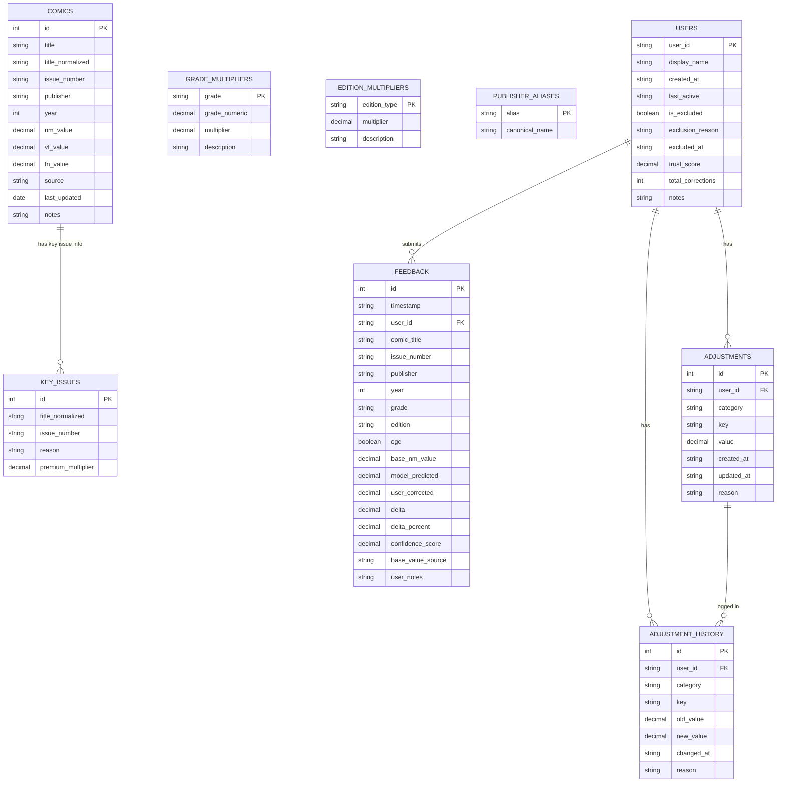
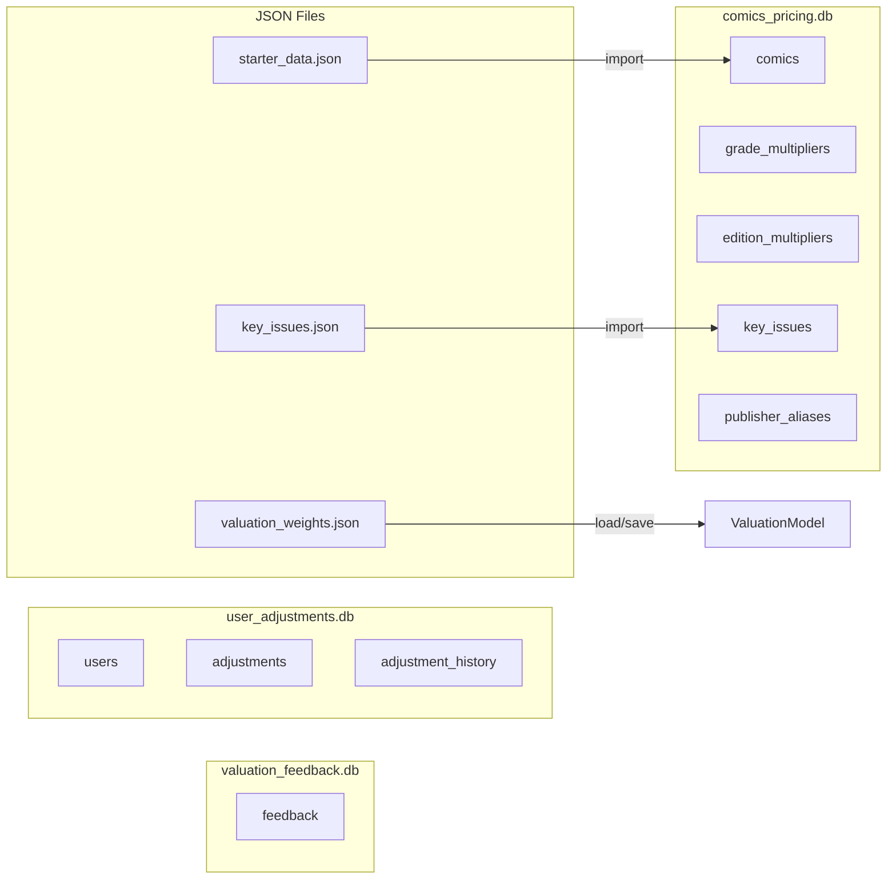

# CollectionCalc Database Schema

## Entity Relationship Diagram



## Database Files



## Table Details

### comics_pricing.db

#### comics
| Column | Type | Description |
|--------|------|-------------|
| id | INTEGER | Primary key |
| title | TEXT | Display title |
| title_normalized | TEXT | Lowercase, standardized for matching |
| issue_number | TEXT | Issue # (handles variants like "1A") |
| publisher | TEXT | Publisher name |
| year | INTEGER | Publication year |
| nm_value | DECIMAL | Near Mint base value |
| source | TEXT | Where price came from |
| last_updated | DATE | Last price update |

#### grade_multipliers
| Column | Type | Description |
|--------|------|-------------|
| grade | TEXT | Grade code (NM, VF, etc.) |
| grade_numeric | DECIMAL | Numeric equivalent (9.4, 8.0, etc.) |
| multiplier | DECIMAL | Value multiplier (NM=1.0 base) |
| description | TEXT | Human-readable description |

#### edition_multipliers
| Column | Type | Description |
|--------|------|-------------|
| edition_type | TEXT | Edition code (direct, newsstand, etc.) |
| multiplier | DECIMAL | Value multiplier |
| description | TEXT | Human-readable description |

### valuation_feedback.db

#### feedback
| Column | Type | Description |
|--------|------|-------------|
| id | INTEGER | Primary key |
| timestamp | TEXT | ISO timestamp |
| user_id | TEXT | User who submitted (nullable) |
| comic_title | TEXT | Comic title |
| issue_number | TEXT | Issue number |
| model_predicted | DECIMAL | What model calculated |
| user_corrected | DECIMAL | What user said it should be |
| delta | DECIMAL | Difference in dollars |
| delta_percent | DECIMAL | Difference as percentage |

### user_adjustments.db

#### users
| Column | Type | Description |
|--------|------|-------------|
| user_id | TEXT | Primary key |
| display_name | TEXT | User's display name |
| is_excluded | BOOLEAN | Excluded from feedback analysis |
| exclusion_reason | TEXT | Why excluded |
| trust_score | DECIMAL | 0.0-1.0 trust rating |
| total_corrections | INTEGER | Count of submissions |

#### adjustments
| Column | Type | Description |
|--------|------|-------------|
| user_id | TEXT | Foreign key to users |
| category | TEXT | Weight category (grade_multipliers, etc.) |
| key | TEXT | Specific key (VF, newsstand, etc.) |
| value | DECIMAL | User's override value |
| reason | TEXT | Why they adjusted |

## Indexes

```sql
-- comics_pricing.db
CREATE INDEX idx_title_normalized ON comics(title_normalized);
CREATE INDEX idx_issue ON comics(issue_number);
CREATE INDEX idx_title_issue ON comics(title_normalized, issue_number);

-- valuation_feedback.db
CREATE INDEX idx_grade ON feedback(grade);
CREATE INDEX idx_edition ON feedback(edition);
CREATE INDEX idx_publisher ON feedback(publisher);
CREATE INDEX idx_user ON feedback(user_id);
CREATE INDEX idx_delta ON feedback(delta_percent);

-- user_adjustments.db
CREATE UNIQUE INDEX idx_user_cat_key ON adjustments(user_id, category, key);
```

## Sample Queries

### Find comic value
```sql
SELECT title, issue_number, nm_value 
FROM comics 
WHERE title_normalized LIKE '%spider-man%' 
  AND issue_number = '300';
```

### Get user's adjustments
```sql
SELECT category, key, value, reason 
FROM adjustments 
WHERE user_id = 'user_123';
```

### Analyze feedback by grade (excluding bad actors)
```sql
SELECT grade, COUNT(*), AVG(delta_percent) 
FROM feedback 
WHERE user_id NOT IN (
    SELECT user_id FROM users WHERE is_excluded = 1
)
GROUP BY grade 
HAVING COUNT(*) >= 5;
```

### Find suspicious users
```sql
SELECT user_id, 
       COUNT(*) as corrections,
       AVG(ABS(delta_percent)) as avg_error,
       MAX(delta_percent) - MIN(delta_percent) as variance
FROM feedback 
GROUP BY user_id 
HAVING avg_error > 40 OR variance > 100;
```
